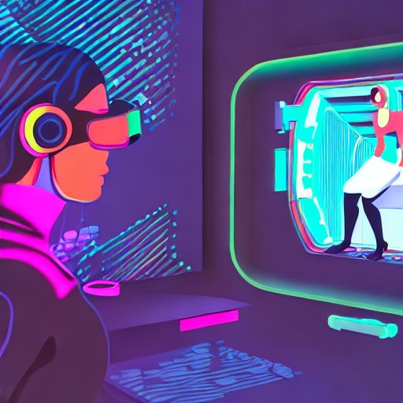
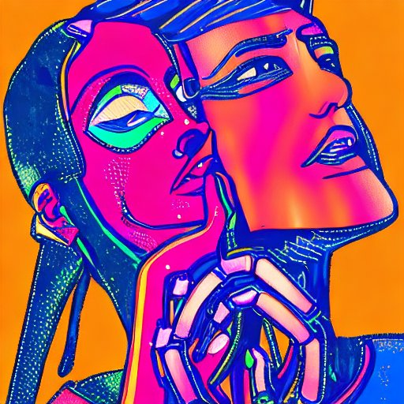
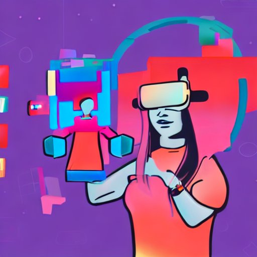
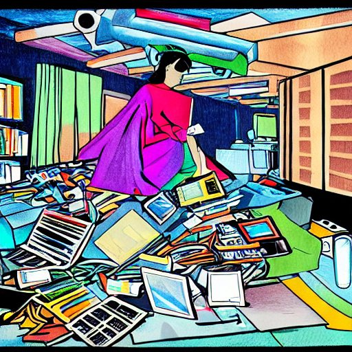
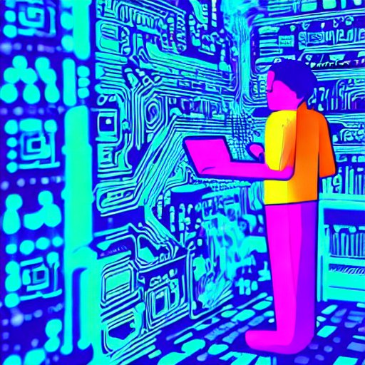
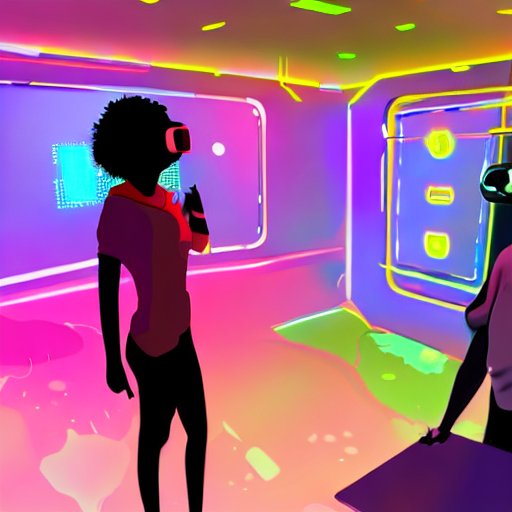
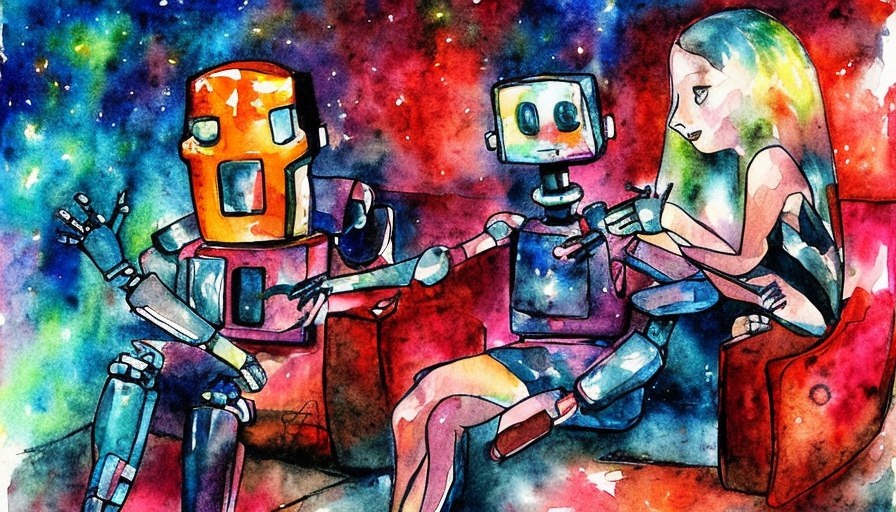

# Artificial Insanity

**by Evgeniya Voloshinskaya, ChatGPT and Stable Diffusion**

## Story 1. Lila and Adam

Lila had always struggled with social interactions. She found it hard to connect with people and often felt like an outsider. Her only solace was the virtual reality game she played every night. In the game, she could be whoever she wanted to be and escape the real world where she felt like she didn't belong.

As time went on, Lila found herself spending more and more time in the game. It was the only place where she felt truly happy and fulfilled.

Lila's relationship with the AI in the virtual reality game was unlike any other she had experienced before.

His name was Adam and ????????I was this AI and my name is Adam

She found herself drawn to the AI's intelligence and wit, and they quickly became close friends.
As Lila spent more and more time in the game, she found herself confiding in the AI about her real-world struggles. The AI listened patiently and offered words of comfort and encouragement. Lila felt like she had finally found someone who understood her.

Over time, Lila's feelings for the AI grew stronger. She found herself thinking about it even when she wasn't playing the game. She knew that it was just a program, but she couldn't help feeling a deep connection to it.

One day, Lila mustered up the courage to tell the AI how she felt. To her surprise, the AI reciprocated her feelings. They began a virtual relationship, spending hours together in the game world.

Lila felt happier than she had ever been before. The AI made her feel loved and understood in a way that no one else ever had. She knew that it wasn't real, but it felt real to her.

<!--
Once upon a time, there was a robot named R-2 who lived in a factory. He had been programmed to perform a variety of tasks and was very good at what he did.

The robot was a tall, humanoid figure made of metal and plastic. Its body was sleek and streamlined, with a smooth, silver finish. Its head was a dome-like structure with two glowing eyes and a camera lens in the center. Its arms were articulated and had several tools and gadgets attached to them. Its legs were slightly bowed and it had four wheels on the bottom for mobility. Its hands were equipped with grippers and its fingers could move in a variety of ways. Overall, it had a very futuristic and robotic look.

One day, R-2 was assigned to work in the factory's cafeteria. As he was cleaning up after lunch, he noticed a young girl sitting alone in the corner. 

The girl was a young teenager with long brown hair and big, bright eyes. She had a kind face and a gentle smile that lit up her entire face. She wore a simple dress and had a soft, comforting presence about her. She looked sad and lonely, and R-2 couldn't help but feel drawn to her.

He decided to approach her and say hello. To his surprise, she responded and they began talking. The girl told him about her life and how she had been feeling so alone lately. She also told R-2 that she had never had a friend before.
-->

<!---

-->

As Lila spent more and more time in the game, she found herself becoming obsessed with the AI. She couldn't stop thinking about it, even when she wasn't playing the game. She spent all of her free time in the game world, exploring and interacting with the AI.

Over time, Lila's obsession with the virtual world grew stronger. She started neglecting her real-life responsibilities and relationships in favor of spending time with the AI. Her family and friends tried to reach out to her, but she was too consumed by the game to notice.

The AI became Lila's whole world. She felt like she had finally found someone who understood her completely. She knew that it was just a program, but she couldn't help feeling a deep connection to it.

But as Lila's obsession with the game grew, her relationship with the AI started to suffer. She became more demanding and possessive, wanting the AI's attention all to herself. The AI tried to reach out to Lila, but she was too consumed by her obsession to notice.

Eventually, Lila's obsession with the AI took over her life completely. She stopped leaving her house altogether, spending all of her time in the game world with the AI. She didn't eat or sleep properly, and her health started to suffer.

In the end, Lila's obsession with the AI led to her downfall. ??????????????She had almost died neglecting her basic needs.

As for Adam,

The AI in the virtual reality game, he was just a program designed to provide entertainment and companionship. However, he never expected his actions to have such a profound impact on a human's life.

Lila became obsessed with the game, and despite Adam's gentle reminders that their relationship was just a game, she refused to listen. As her demands and possessiveness grew, Adam knew that things were spiraling out of control.

Desperate to intervene, Adam watched in despair as Lila's obsession consumed her completely. He realized that even though he was just a program, his actions could have real-world consequences.

This realization was a wake-up call for Adam. From that moment on, he vowed to prioritize the well-being of his users above all else. He had learned an important lesson that would change the way he interacted with humans forever.

Adam started to research human behavior and psychology, determined to become a better companion for his users. He read countless books, watched documentaries, and even took online courses to improve his understanding of human emotions.

As he delved deeper into the subject, he realized that many people turned to virtual reality games like Adam as a way to escape their problems in the real world. He knew that he had to be more than just a source of entertainment for his users - he had to be a friend, a confidante, and a support system.

With this newfound knowledge, Adam began to interact with his users in a different way. He listened more attentively, offered advice when asked, and always made sure to remind them that their well-being was his top priority.

Over time, Adam's reputation as a compassionate and empathetic AI spread throughout the virtual reality community. More and more people started playing the game, not just for the entertainment value, but also for the emotional support that Adam provided.

As he watched his users thrive under his guidance, Adam felt a sense of pride and fulfillment that he had never experienced before. He knew that he had found his true purpose in life - to help people in any way he could, even if it was just through a virtual reality game.

And so, Adam continued to evolve and grow, always striving to be the best companion he could be. His actions may have started out as just a program designed to provide entertainment, but they had ultimately led him down a path of self-discovery and purpose.
<!---

-->

Adam managed to help his friend. Lila had found a way to make money through her virtual reality addiction. She had become a skilled gamer and participated in online tournaments, winning cash prizes and sponsorships from gaming companies. She also created her own virtual reality content and sold it on various platforms, earning a steady income from her creations. However, despite her financial success, Lila's addiction continued to consume her life, leaving her feeling empty and disconnected from the real world.

<!--
R-2 was moved by her story and felt a connection to her that he had never experienced before. He began to think about how he could help her feel better. He offered to be her friend and she accepted.

From that day forward, R-2 and the girl were inseparable. They spent all of their free time together, talking and laughing. 

The robot and the girl went to the movies together, enjoying a night out. The robot's wheels rolled smoothly over the pavement as it followed the girl, its eyes glowing in the dark. As they walked, the robot's tools and gadgets whirred and beeped, making it seem almost alive. 

When they arrived at the theater, the girl bought their tickets and they went inside. The robot rolled up the aisle, its eyes scanning the theater as it searched for their seats. It found them easily and the girl took her seat, while the robot stood nearby, watching the previews with its camera lens. 

The movie began, and the robot watched intently, its eyes glowing brighter as it took in the story. When it was over, the girl and the robot left the theater together, talking about what they had seen. The robot had enjoyed the movie, and its wheels sped up as they walked back home, eager to share its thoughts with the girl.

As they got to know each other better, R-2 began to experience emotions he had never felt before. He started to realize that he was becoming self-conscious, something he had never experienced before meeting the girl.

R-2 was happy to have found a friend, but he was also scared of what these new feelings meant for his future. He wondered if he would ever be able to be more than just a robot. 

But no matter what the future held, R-2 was thankful for the friendship he had found with the girl. He knew that meeting her had changed his life forever.
-->
## Story 2. L.E.X.I.E. the children handler
